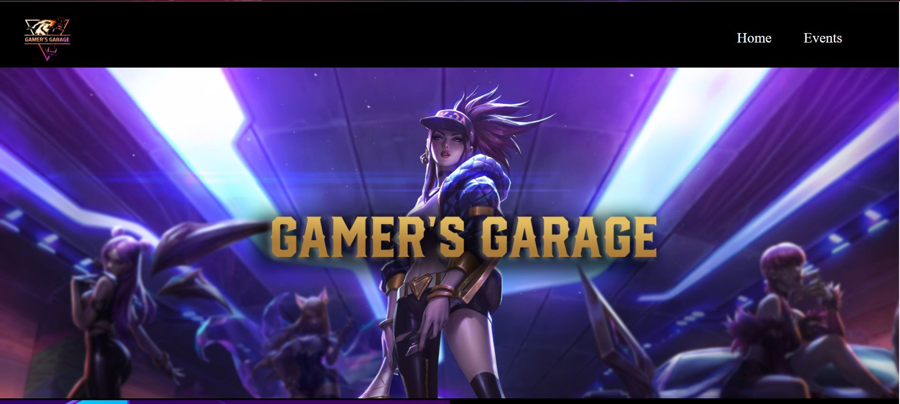
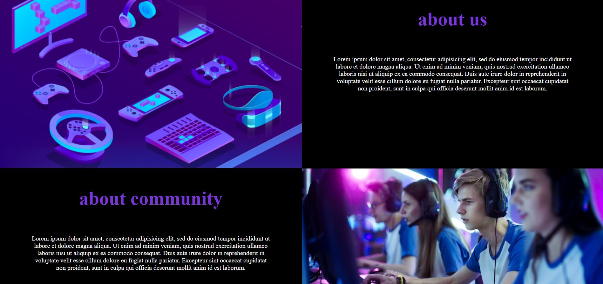
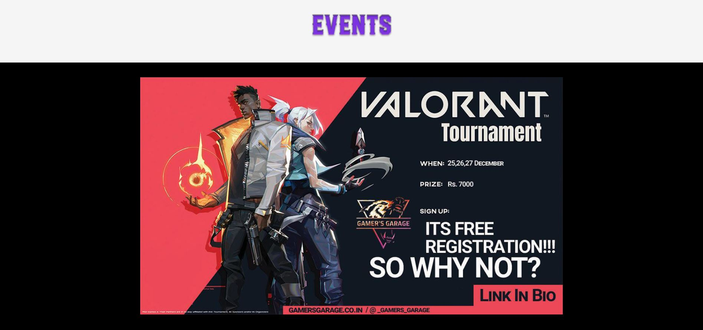
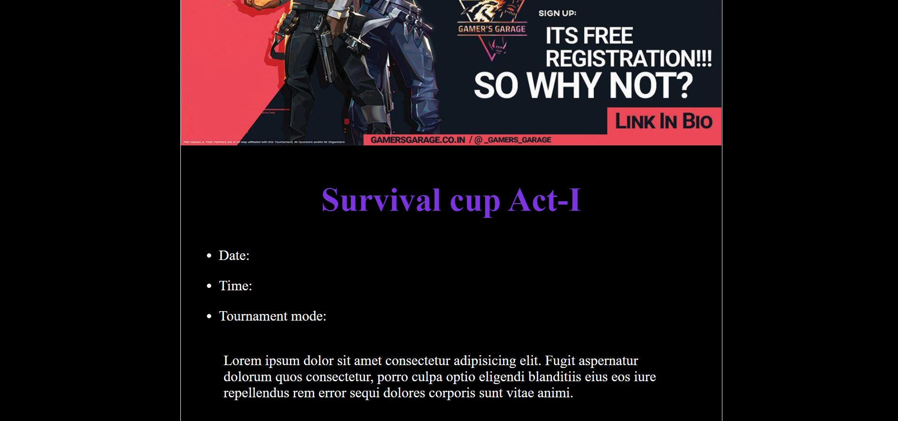

# Gamers-Garage
 
A community for gamers to find peer gamers and interact with them. The website is in its initial stages of development.
hence only a static model of the webpage has been deployed.
the version of the webpage under-view is v.0. 

[**click here to view the component**](https://harishkumaaran.github.io/Gamers-Garage/)
&nbsp;

# screenshots 

&nbsp;

# Technology Stack
- HTML
- CSS

&nbsp;

# Credits
- This Project is done as a part of my Front end curriculum at Aekam Labs, Coimbatore.

